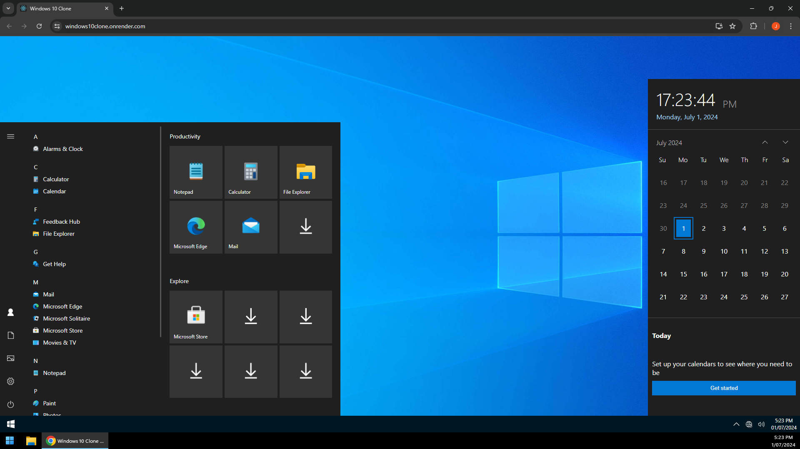

# Windows 10 Clone

*Windows 10 Clone* is an ongoing web application development project designed to emulate the user interface and functionality of the Windows 10 operating system. This project aims to provide users with a near 1-to-1 experience of the base Windows UI, including a functional persistent file structure, applications like Notepad, Calculator and Photo Viewer, and the ability to customise the environment with standard Windows UI features, such as desktop, wallpaper and theme changes, control panel access, system settings and more.

## Introduction

This project serves as a demonstration of full-stack development skills, showcasing the integration of a JavaScript front end with a C# backend to recreate the Windows 10 user experience within a web application.

## Access the Application

You can access the running application [here](https://windows10clone.onrender.com/). 
This link allows you to explore all of the currently implemented features of the Windows 10 Clone live.

## Screenshot

## Project Goals

- Achieve a user experience as close to the base Windows UI as possible.
- Implement a functional and persistent file structure with an explorer.
- Develop applications like Notepad, Calculator and Photo Viewer.
- Create a C# Web REST API serving Swagger docs as the backend.
- Integrate Windows UI elements such as the Control Panel and other system screens.
- Ensure a consistent user experience across varying screen sizes.

## Planned Features

- **Taskbar and Start Menu**: Functional taskbar and start menu similar to Windows 10.
- **File Explorer**: Persistent file structure to create, move, and delete files and folders.
- **Drag and Drop Functionality**: Enable drag-and-drop functionality for files, applications, and desktop items.
- **Context Menus**: Implement right-click context menus for files, folders, and desktop items to provide additional options.
- **Notepad**: Create, edit, and save text files within the file system.
- **Calculator**: Functional calculator application.
- **Picture Viewer**: View and move pictures within the file system.
- **Windows Calendar**: Fully featured calendar with day, month, and year selection.
- **Complete Windows UI**: Integration of various Windows screens and settings for a comprehensive user experience.
- **User Personalisation**: Allow users to personalise their desktop with custom wallpapers, icons, and themes.

## Technologies Used

### Front End
- **JavaScript**
- **HTML5**
- **CSS3**
- **React**

### Back End
- **C#**
- **.NET Core**

### Additional Tools
- **Render**
- **Swagger Docs**

## License

This project is licensed under [Attribution-NonCommercial-NoDerivatives 4.0 International](https://creativecommons.org/licenses/by-nc-nd/4.0/).

## Disclaimer

This project is not affiliated with or endorsed by Microsoft. All trademarks are the property of their respective owners.
